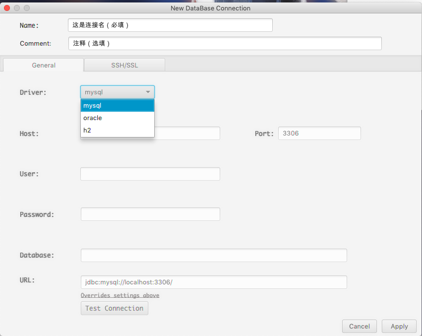
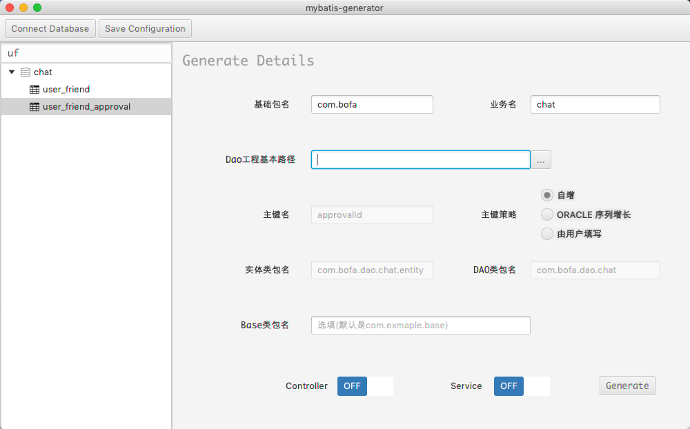

# Mybatis-Generator-Gui

借鉴于<https://github.com/zouzg/mybatis-generator-gui> zouzg的作品

加入了Sv(sv和dto)层和Controller层的自动生成以及对应的基类(BaseSv, BaseMapper, 
BaseEntity -> MybatisEntity, BaseDto -> JsonBean)的生
>  当然, sv层和controller层是toggle可选的

Connect Database 界面设计借鉴于DataGrip

这里只介入了三种数据库的策略(Oracle, Mysql, H2(本人常用))

这里填写Host, Port, Database会监听自动填充URL, 相反填写URL也会监听自动填充Host, Port, Database

填写完数据库配置信息后, 可点选Test Connection测试连接是否成功, 再者点选Apply保存数据库配置并返回主界面

>   Note: 这里强调一点,  H2 要考虑embedded，remote, in-memory类型, 因此不考虑填充, 仅支持URL_ONLY

主界面在zouzg大佬的项目设计基础上加入了search bar(支持schema和table的模糊搜索)

JavaFx 没有相应的FilterableTreeItem控件, 这里是借鉴国外某大佬的workground, 跟进com.bofa.javafx.extension.FilterableTreeItem 可以了解详情

这里解释下基础包名, 业务名和Dao工程基本路径以及Server工程和Controller工程

sample: 

1.  基础包名 com.bofa
2.  业务名 chat
3.  Dao工程基本路径 xx-project/xx-service-module/src/main/java (dao层和service层在同一个module, 个人习惯)
4.  Service工程基本路径 xx-project/xx-service-module/src/main/java
5.  Controller工程基本路径 xx-project/xx-controller-module/src/main/java

base基类 生成位置 -> xx-project/xx-service-module/src/main/java/com/bofa/service/base/BaseMapper&BaseSv&JsonBean&MybatisEntity

mapper以及xml文件生成位置 -> xx-project/xx-service-module/src/main/java/com/bofa/dao/chat/xxMapper

pojo 生成位置  -> xx-project/xx-service-module/src/main/java/com/bofa/dao/chat/entity/xx

sv 生成位置  -> xx-project/xx-service-module/src/main/java/com/bofa/service/chat/xxSv

dto 生成位置 -> xx-project/xx-service-module/src/main/java/com/bofa/service/chat/dto/xxQueryReq

controller 生成位置 -> xx-project/xx-controller-module/src/main/java/com/bofa/controller/chat/xxController

太详细的不赘述了, 简单的开发工具, 有额外需求的欢迎fork, javafx的确坑, controller-module 待后续想开发页面端(奈何太久没接触前端, vue和react也没捣鼓过, 好的下次一定咕咕😄)

哦对了, 引入了javafx-maven-plugin插件可以打包exe和dmg, clone该项目, mvn package 即可, 在jfx/native下会根据对应的操作系统生成对应的exe或dmg.